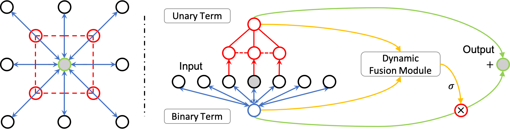

# LESA_classification

<div align="center">
  
</div>

## Introduction

This repository contains the official implementation of [Locally Enhanced Self-Attention: Rethinking Self-Attention as Local and Context Terms](http://arxiv.org/abs/2107.05637).
The code for ImageNet classification is based on [axial-deeplab](https://github.com/csrhddlam/axial-deeplab). Please refer to [LESA](https://github.com/Chenglin-Yang/LESA) for the whole project.

## Installation

Please refer to [preparation](https://github.com/csrhddlam/axial-deeplab#preparation) to prepare the environment. After that, please issue: 
```bash
pip install tqdm
```

## Main Results on ImageNet

| Method    | Config | Model | Top-1 Acc. | Top-5 Acc. |
|-----------|--------------|--------------|:------------:|:------------:|
| LESA_ResNet50 | [File Link](config/lesa_resnet.py) | [Download](https://livejohnshopkins-my.sharepoint.com/:f:/g/personal/cyang76_jh_edu/EnO2WCZcRwJJh1YsdHEZXOMBueC6q0baT4kWl_sI5SqjFQ?e=Wh9uWt) | 79.55 | 94.79 |
| LESA_WRN50 | [File Link](config/lesa_wrn.py) | [Download](https://livejohnshopkins-my.sharepoint.com/:f:/g/personal/cyang76_jh_edu/EgHuW1XQefNNkLCkRE1Ag4UBA96d7lBasZ4esEh3Re1mXA?e=jU72GG) | 80.18 | 95.07 |

## Citing LESA

If you find LESA is helpful in your project, please consider citing our paper.

```BibTeX
@article{yang2021locally,
  title={Locally Enhanced Self-Attention: Rethinking Self-Attention as Local and Context Terms},
  author={Yang, Chenglin and Qiao, Siyuan and Kortylewski, Adam and Yuille, Alan},
  journal={arXiv preprint arXiv:2107.05637},
  year={2021}
}
```

## Usage

### Training:
```bash
# LESA_ResNet50
CUDA_VISIBLE_DEVICES=0,1,2,3 \
python train.py \
--model resnet50 --gpu_id 0,1,2,3 --batch_size 128 --val_batch_size 128 \
--lr 0.05 --nesterov \
--epochs 95 --warmup_epochs 5 \
--name lesa_resnet50 \
--cfg config/lesa_resnet.py \
--work_dirs ./results/lesa_resnet50_train/
```
```bash
# LESA_WRN50
CUDA_VISIBLE_DEVICES=0,1,2,3 \
python train.py \
--model resnet50 --gpu_id 0,1,2,3 --batch_size 128 --val_batch_size 128 \
--lr 0.05 --nesterov \
--epochs 95 --warmup_epochs 5 \
--name lesa_wrn50 \
--cfg config/lesa_wrn.py \
--work_dirs ./results/lesa_wrn50_train/
```

### Testing:
+ Before testing, please download the checkpoints (folders) and put them in ./results/.
```bash
# LESA_ResNet50
CUDA_VISIBLE_DEVICES=0 \
python train.py \
--model resnet50 --gpu_id 0 --batch_size 128 --val_batch_size 128 \
--lr 0.05 --nesterov \
--epochs 95 --warmup_epochs 5 \
--name lesa_resnet50 \
--cfg config/lesa_resnet.py \
--test \
--test_weight checkpoint \
--work_dirs ./results/lesa_resnet50/
```
```bash
# LESA_WRN50
CUDA_VISIBLE_DEVICES=1 \
python train.py \
--model resnet50 --gpu_id 1 --batch_size 128 --val_batch_size 128 \
--lr 0.05 --nesterov \
--epochs 95 --warmup_epochs 5 \
--name lesa_wrn50 \
--cfg config/lesa_wrn.py \
--test \
--test_weight checkpoint \
--work_dirs ./results/lesa_wrn50/ 
```

## Credits

This project is based on [axial-deeplab](https://github.com/csrhddlam/axial-deeplab) and [mmdetection](https://github.com/open-mmlab/mmdetection).

Relative position embedding is based on [bottleneck-transformer-pytorch](https://github.com/lucidrains/bottleneck-transformer-pytorch/blob/main/bottleneck_transformer_pytorch/bottleneck_transformer_pytorch.py)

ResNet is based on [pytorch/vision](https://github.com/pytorch/vision/blob/master/torchvision/models/resnet.py). Classification helper functions are based on [pytorch-classification](https://github.com/bearpaw/pytorch-classification).

